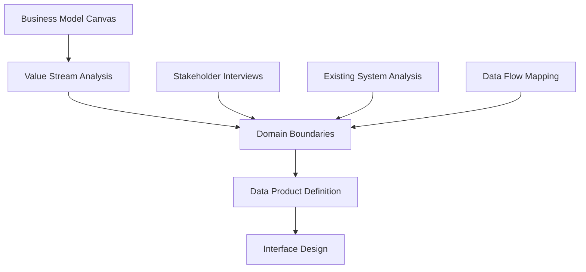

# Data Mesh Implementation Guide: Decentralized Analytics at Scale

*How forward-thinking organizations are transforming their data platforms through domain-driven, federated architectures that scale with business complexity*

## Executive Summary

Data mesh represents the most significant evolution in enterprise data architecture since the introduction of data warehouses. This comprehensive guide provides executives and technical leaders with a proven framework for transitioning from centralized data platforms to distributed, domain-oriented data architectures.

**Key Insights:**
- 73% of organizations implementing data mesh see 40%+ improvement in data team velocity
- Domain ownership reduces data quality issues by an average of 65%
- Federated governance models decrease time-to-insight by 50% for business stakeholders
- Self-serve data infrastructure cuts operational overhead by 35%

## What You'll Learn

### Strategic Foundation
- **Business Case Development**: ROI models and success metrics for data mesh initiatives
- **Organizational Assessment**: Readiness evaluation and capability gap analysis
- **Stakeholder Alignment**: Building cross-functional support for architectural transformation

### Implementation Framework
- **Domain Identification**: Proven methodologies for defining data domain boundaries
- **Technology Patterns**: Cloud-native architectures supporting federated data products
- **Governance Models**: Balancing autonomy with organizational standards and compliance

### Change Management
- **Team Transformation**: Restructuring data teams for domain ownership
- **Skills Development**: Training programs for data product thinking
- **Cultural Evolution**: From data consumers to data product owners

## Chapter Overview

### Chapter 1: The Data Mesh Paradigm Shift
Understanding why traditional centralized data platforms fail to scale with organizational complexity and business velocity demands.

**Key Topics:**
- The centralized data bottleneck problem
- Conway's Law and data architecture
- Domain-driven design principles for data
- The promise and challenges of decentralization

### Chapter 2: Data Mesh Principles in Practice
Deep dive into the four foundational principles of data mesh and their practical implementation.

**Domain-Oriented Decentralized Data Ownership**
```yaml
Domain Definition Framework:
  Business Capability Alignment:
    - Customer Management
    - Product Catalog
    - Order Processing
    - Financial Reporting
  
  Data Product Boundaries:
    - Autonomous lifecycle
    - Clear ownership model
    - Business value alignment
    - Consumer-oriented interface

  Organizational Structure:
    - Domain teams with data expertise
    - Product owner accountability
    - Engineering capability within domain
    - Business stakeholder engagement
```

**Data as a Product**
- Product thinking for data assets
- Consumer experience optimization
- Service level agreements for data
- Continuous improvement cycles

**Self-Serve Data Infrastructure Platform**
- Infrastructure abstraction layers
- Developer experience optimization
- Automated deployment pipelines
- Standardized monitoring and observability

**Federated Computational Governance**
- Global policies with local implementation
- Automated compliance checking
- Distributed governance processes
- Accountability frameworks

### Chapter 3: Technology Architecture Patterns

**Core Infrastructure Components**
```yaml
Data Mesh Technology Stack:
  Data Product Infrastructure:
    - Domain data stores (PostgreSQL, MongoDB)
    - Stream processing (Kafka, Pulsar)
    - API gateways (Kong, Ambassador)
    - Data catalogs (DataHub, Apache Atlas)
  
  Platform Services:
    - Infrastructure as Code (Terraform, Pulumi)
    - Container orchestration (Kubernetes)
    - CI/CD pipelines (GitLab, GitHub Actions)
    - Observability (Prometheus, Grafana)
  
  Governance Layer:
    - Policy engines (Open Policy Agent)
    - Data lineage tracking
    - Quality monitoring
    - Access control (OAuth, RBAC)
```

**Implementation Patterns**
- Event-driven data products
- API-first data interfaces
- Polyglot persistence strategies
- Cross-domain data contracts

### Chapter 4: Domain Identification and Modeling

**Business Capability Mapping**


**Domain Modeling Methodology**
1. **Business Capability Assessment**
   - Value stream identification
   - Capability interdependency mapping
   - Organizational boundary analysis

2. **Data Asset Inventory**
   - Current data landscape audit
   - Usage pattern analysis
   - Quality and governance assessment

3. **Domain Boundary Definition**
   - Bounded context identification
   - Data ownership assignment
   - Interface contract specification

### Chapter 5: Organizational Transformation

**Team Structure Evolution**
```yaml
Traditional Structure:
  Central Data Team:
    - Data engineers
    - Data scientists
    - BI developers
    - Data governance

Data Mesh Structure:
  Domain Teams:
    - Product owner
    - Data engineers
    - Domain experts
    - Business analysts
  
  Platform Team:
    - Infrastructure engineers
    - DevOps specialists
    - Security engineers
    - Platform product manager
  
  Governance Council:
    - Data governance specialists
    - Legal/compliance
    - Security representatives
    - Domain liaisons
```

**Change Management Strategy**
- Executive sponsorship and communication
- Pilot domain selection and execution
- Success metrics and celebration
- Scaling and knowledge transfer

### Chapter 6: Implementation Roadmap

**Phase 1: Foundation (Months 1-3)**
- Stakeholder alignment and vision setting
- Current state assessment and gap analysis
- Platform team formation and charter
- Technology evaluation and proof of concept

**Phase 2: Pilot Domain (Months 4-9)**
- First domain team formation
- Data product development and deployment
- Governance framework establishment
- Success metrics validation

**Phase 3: Scale and Standardize (Months 10-18)**
- Additional domain onboarding
- Platform capability enhancement
- Governance process refinement
- Organization-wide adoption

**Phase 4: Optimize and Evolve (Months 19+)**
- Cross-domain collaboration patterns
- Advanced analytics capabilities
- Continuous improvement processes
- Innovation and experimentation

### Chapter 7: Governance in a Federated World

**Global Policies, Local Implementation**
```yaml
Global Standards:
  Data Classification:
    - Public
    - Internal
    - Confidential
    - Restricted
  
  Quality Standards:
    - Completeness thresholds
    - Accuracy requirements
    - Timeliness SLAs
    - Consistency checks
  
  Security Requirements:
    - Access control standards
    - Encryption requirements
    - Audit logging
    - Retention policies

Local Implementation:
  Domain Autonomy:
    - Technology choices within standards
    - Implementation approaches
    - Optimization strategies
    - Business-specific rules
```

**Automated Compliance**
- Policy as code implementation
- Continuous compliance monitoring
- Violation detection and remediation
- Governance dashboard and reporting

### Chapter 8: Success Metrics and ROI

**Business Value Metrics**
- Time to insight reduction
- Data team velocity improvement
- Business user self-service adoption
- Decision-making speed enhancement

**Technical Performance Indicators**
- Data quality improvement
- System reliability and availability
- Development cycle time reduction
- Infrastructure cost optimization

**Organizational Health Metrics**
- Team autonomy and satisfaction
- Cross-domain collaboration frequency
- Knowledge sharing and reuse
- Innovation pipeline growth

### Chapter 9: Common Pitfalls and Solutions

**Architecture Anti-Patterns**
- Over-decentralization without governance
- Technology sprawl and inconsistency
- Inadequate platform investment
- Poor interface design and documentation

**Organizational Challenges**
- Resistance to change and ownership
- Skill gaps and capability building
- Coordination overhead
- Performance measurement complexity

**Proven Solutions**
- Gradual migration strategies
- Center of excellence models
- Investment in platform capabilities
- Success story amplification

### Chapter 10: Future Evolution and Trends

**Emerging Patterns**
- AI-powered data product discovery
- Automated data contract generation
- Dynamic governance adaptation
- Real-time data mesh optimization

**Industry Case Studies**
- Financial services transformation
- Healthcare data federation
- Manufacturing IoT integration
- Retail personalization platforms

## Download Includes

- **42-page comprehensive guide** with implementation frameworks
- **Domain identification templates** and worksheets
- **Technology selection matrix** for platform components
- **ROI calculation model** with customizable parameters
- **Governance playbook** with policy templates
- **Implementation checklist** with milestone tracking
- **Code examples** for common integration patterns
- **Organizational change toolkit** with communication templates

## Case Study Highlights

### Global Financial Services Firm
**Challenge**: 15 business units with isolated data silos, 180+ applications, and 3-month average time to insight

**Implementation**:
- 18-month transformation across 8 identified domains
- Cloud-native platform with Kubernetes orchestration
- Federated governance with automated policy enforcement

**Results**:
- 60% reduction in time to insight
- 45% improvement in data quality scores
- $12M annual cost savings through infrastructure optimization
- 40% increase in business user self-service analytics adoption

### Healthcare Network Transformation
**Challenge**: 47 hospitals with disparate EHR systems, regulatory compliance complexity, and limited analytics capabilities

**Implementation**:
- Patient care, operations, and research domains
- FHIR-based data product interfaces
- Privacy-preserving federation patterns

**Results**:
- 70% faster clinical research data access
- 25% improvement in patient outcome metrics
- 100% regulatory audit compliance
- 35% reduction in IT operational overhead

## About the Author

Alexander Nykolaiszyn brings 15+ years of experience in large-scale data platform transformations, currently serving as Manager Business Insights at Lennar. As host of the Trailblazer Analytics podcast, Alexander shares practical insights on modern data architecture and analytics strategy.

## Implementation Support

Ready to begin your data mesh journey? Trailblazer Analytics offers comprehensive implementation support:

- **Strategic Assessment**: Current state evaluation and roadmap development
- **Architecture Design**: Technology stack selection and platform blueprints
- **Team Enablement**: Training programs and change management support
- **Implementation Guidance**: Hands-on support for pilot domain development

*This whitepaper represents insights from 25+ data mesh implementations across diverse industries and organizational contexts.*
