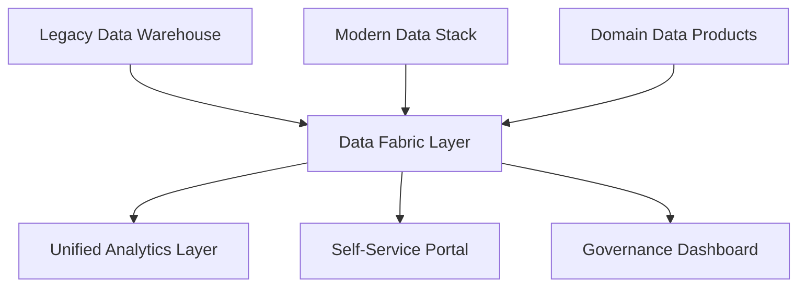

# Modern Data Architecture Patterns: From Monoliths to Mesh

The data architecture landscape has undergone dramatic transformation over the past decade. From centralized data warehouses to distributed data mesh architectures, organizations are rethinking how they structure, govern, and scale their data ecosystems. This guide explores modern patterns and helps you choose the right approach for your organization.

## The Evolution of Data Architecture

### Traditional Data Warehouse (Monolithic Pattern)

**Architecture Characteristics:**
- Centralized storage and processing
- ETL-based data pipelines
- Single source of truth approach
- Tightly coupled systems

**Strengths:**
- Consistent data governance
- Strong ACID compliance
- Mature tooling ecosystem
- Clear ownership model

**Limitations:**
- Scalability bottlenecks
- Slow time-to-market for new use cases
- Technology lock-in
- Single point of failure

**When to Use:**
- Highly regulated industries requiring strict governance
- Organizations with stable, well-defined data requirements
- Teams with limited data engineering resources

### Data Lake Architecture

**Design Principles:**
```
Raw Data Ingestion → Schema-on-Read → Multi-Format Support → Elastic Scaling
```

**Implementation Example:**
```python
# Data lake ingestion pattern
class DataLakeIngestion:
    def __init__(self, storage_account, container):
        self.storage = storage_account
        self.container = container
    
    def ingest_streaming_data(self, source_stream):
        # Raw data ingestion with minimal transformation
        partition_path = f"year={datetime.now().year}/month={datetime.now().month}/day={datetime.now().day}"
        
        return source_stream.writeStream \
            .format("delta") \
            .option("path", f"{self.storage}/{self.container}/raw/{partition_path}") \
            .option("checkpointLocation", f"{self.storage}/checkpoints/") \
            .start()
    
    def apply_schema_evolution(self, df, target_schema):
        # Schema evolution handling
        return df.select(*[col(c).cast(target_schema[c]) for c in target_schema.keys()])
```

**Best Use Cases:**
- Diverse data sources and formats
- Exploratory analytics and data science
- Cost-effective storage for large volumes
- Flexible schema requirements

### Modern Data Stack Architecture

**Technology Stack:**
- **Ingestion**: Fivetran, Stitch, Airbyte
- **Storage**: Snowflake, BigQuery, Databricks
- **Transformation**: dbt, Dataform
- **Orchestration**: Airflow, Prefect, Dagster
- **Visualization**: Tableau, Looker, Power BI

**dbt Transformation Example:**
```sql
-- models/marts/customer_metrics.sql
{{ config(materialized='table') }}

WITH customer_orders AS (
    SELECT 
        customer_id,
        COUNT(*) as total_orders,
        SUM(order_value) as lifetime_value,
        MAX(order_date) as last_order_date,
        MIN(order_date) as first_order_date
    FROM {{ ref('fact_orders') }}
    GROUP BY customer_id
),

customer_segments AS (
    SELECT 
        *,
        CASE 
            WHEN lifetime_value >= 10000 THEN 'Premium'
            WHEN lifetime_value >= 5000 THEN 'Gold'
            WHEN lifetime_value >= 1000 THEN 'Silver'
            ELSE 'Bronze'
        END as customer_segment,
        
        CASE 
            WHEN last_order_date >= CURRENT_DATE - INTERVAL '30 days' THEN 'Active'
            WHEN last_order_date >= CURRENT_DATE - INTERVAL '90 days' THEN 'At Risk'
            ELSE 'Inactive'
        END as customer_status
    FROM customer_orders
)

SELECT * FROM customer_segments
```

**Advantages:**
- Best-of-breed tool selection
- Rapid implementation and iteration
- Strong community support
- Version control for data transformations

## Data Mesh Architecture: The Paradigm Shift

### Core Principles

**1. Domain Ownership**
Each business domain owns its data products and is responsible for their quality, governance, and lifecycle management.

**2. Data as a Product**
Data is treated as a product with clear APIs, documentation, SLAs, and user experience considerations.

**3. Self-Serve Data Infrastructure**
Standardized, reusable infrastructure components that domain teams can use independently.

**4. Federated Computational Governance**
Distributed governance model with global standards and local implementation flexibility.

### Data Mesh Implementation

**Domain Data Product Example:**
```python
# Customer domain data product
class CustomerDataProduct:
    def __init__(self):
        self.domain = "customer"
        self.version = "v2.1"
        self.sla = {
            "availability": "99.9%",
            "freshness": "< 15 minutes",
            "quality_threshold": "95%"
        }
    
    def get_customer_profile(self, customer_id):
        """
        Provides comprehensive customer profile data
        
        Returns:
            - Personal information
            - Preferences and settings
            - Interaction history summary
            - Risk and compliance status
        """
        return self._fetch_from_domain_store(customer_id)
    
    def get_customer_metrics(self, time_range):
        """
        Aggregated customer metrics for analytics
        
        Includes:
            - Acquisition trends
            - Engagement metrics
            - Lifetime value calculations
            - Churn risk indicators
        """
        return self._calculate_domain_metrics(time_range)
    
    def validate_data_contract(self):
        """Ensures data product meets defined contracts"""
        quality_score = self._run_quality_checks()
        if quality_score < self.sla["quality_threshold"]:
            raise DataContractViolation(f"Quality below threshold: {quality_score}")
        return True
```

**Infrastructure as Code for Data Products:**
```yaml
# data-product-infrastructure.yml
apiVersion: v1
kind: DataProduct
metadata:
  name: customer-analytics
  domain: customer
  owner: customer-team@company.com
spec:
  storage:
    type: delta-lake
    location: s3://data-mesh/customer/analytics/
    retention: 7-years
  
  compute:
    type: spark-cluster
    autoscaling: true
    min_workers: 2
    max_workers: 20
  
  api:
    type: graphql
    endpoint: /api/customer/v2
    authentication: oauth2
  
  monitoring:
    data_quality:
      - completeness > 95%
      - uniqueness > 99%
      - timeliness < 15min
    
    performance:
      - query_response < 2s
      - availability > 99.9%
  
  governance:
    classification: PII
    retention_policy: 7-years
    access_controls:
      - role: analyst
        permissions: [read]
      - role: data-scientist
        permissions: [read, aggregate]
```

### Real-World Data Mesh Success Story

**Global E-commerce Platform Implementation:**

**Challenge:**
- 50+ domains with independent data needs
- 300+ data engineers across 12 countries
- Inconsistent data quality and governance
- 6-month average time-to-market for new analytics

**Data Mesh Solution:**
- 15 domain data products implemented
- Self-service infrastructure platform
- Federated governance framework
- Standardized data contracts

**Results After 18 Months:**
- **70% reduction** in time-to-market for new analytics
- **85% improvement** in data quality scores
- **60% increase** in data team productivity
- **$12M annual savings** from reduced duplication

## Choosing the Right Architecture Pattern

### Decision Framework

**Organization Size and Complexity:**

| Pattern | Best For | Team Size | Domains |
|---------|----------|-----------|---------|
| Data Warehouse | Traditional BI | 5-20 | 1-3 |
| Data Lake | Diverse analytics | 10-50 | 3-10 |
| Modern Stack | Agile analytics | 15-75 | 5-15 |
| Data Mesh | Enterprise scale | 50+ | 10+ |

**Technical Maturity Assessment:**
```python
def assess_data_architecture_readiness():
    maturity_factors = {
        'engineering_capability': rate_engineering_skills(),
        'domain_expertise': assess_business_domains(),
        'governance_maturity': evaluate_governance(),
        'technology_stack': audit_current_tools(),
        'organizational_alignment': measure_collaboration()
    }
    
    if all(score >= 7 for score in maturity_factors.values()):
        return "data_mesh_ready"
    elif maturity_factors['engineering_capability'] >= 6:
        return "modern_stack_suitable"
    elif maturity_factors['governance_maturity'] >= 7:
        return "data_warehouse_optimal"
    else:
        return "data_lake_foundation"
```

## Hybrid Approaches and Migration Strategies

### Gradual Migration Pattern

**Phase 1: Foundation (Months 1-6)**
- Establish modern data stack
- Implement core data engineering practices
- Build initial domain data products

**Phase 2: Federation (Months 6-12)**
- Introduce federated governance
- Expand domain ownership model
- Develop self-service capabilities

**Phase 3: Full Mesh (Months 12-24)**
- Complete domain data product portfolio
- Mature federated governance
- Optimize for scale and performance

### Coexistence Architecture



**Benefits of Coexistence:**
- Minimize disruption to existing systems
- Gradual migration reduces risk
- Preserve investments in legacy systems
- Enable innovation in parallel

## Implementation Best Practices

### 1. Start with Data Contracts

**Sample Data Contract:**
```json
{
  "data_product": "customer_analytics",
  "version": "2.1.0",
  "schema": {
    "customer_id": {
      "type": "string",
      "required": true,
      "pii": true
    },
    "acquisition_date": {
      "type": "date",
      "required": true,
      "format": "YYYY-MM-DD"
    },
    "lifetime_value": {
      "type": "decimal",
      "precision": 10,
      "scale": 2,
      "min_value": 0
    }
  },
  "sla": {
    "availability": "99.9%",
    "freshness": "15 minutes",
    "quality": {
      "completeness": "> 95%",
      "accuracy": "> 98%"
    }
  },
  "governance": {
    "owner": "customer-team@company.com",
    "steward": "data-governance@company.com",
    "classification": "PII",
    "retention": "7 years"
  }
}
```

### 2. Implement Progressive Decentralization

**Decentralization Roadmap:**
1. **Centralized**: Single team manages all data
2. **Federated**: Multiple teams with shared standards
3. **Distributed**: Domain teams with self-service platform
4. **Autonomous**: Fully independent domain data products

### 3. Invest in Observability

**Data Observability Stack:**
```python
# Data observability implementation
class DataObservability:
    def __init__(self, data_product):
        self.data_product = data_product
        self.metrics_collector = MetricsCollector()
        self.alerting = AlertingService()
    
    def monitor_data_quality(self):
        quality_metrics = {
            'completeness': self.calculate_completeness(),
            'freshness': self.check_data_freshness(),
            'volume': self.measure_data_volume(),
            'schema_drift': self.detect_schema_changes()
        }
        
        for metric, value in quality_metrics.items():
            if self.is_threshold_breached(metric, value):
                self.alerting.send_alert(
                    severity='high',
                    message=f'Data quality issue in {self.data_product.name}: {metric} = {value}'
                )
        
        return quality_metrics
    
    def track_lineage(self):
        """Track data lineage for impact analysis"""
        return self.data_product.get_lineage_graph()
```

## Governance in Modern Architectures

### Federated Governance Model

**Global Standards:**
- Data classification scheme
- Privacy and security policies
- Quality measurement standards
- Metadata management requirements

**Local Implementation:**
- Domain-specific quality rules
- Business context and definitions
- Access control implementation
- Performance optimization

### Automated Governance Implementation

```sql
-- Automated data governance checks
CREATE OR REPLACE FUNCTION enforce_data_governance()
RETURNS TRIGGER AS $$
BEGIN
    -- PII detection and masking
    IF detect_pii(NEW.*) THEN
        NEW := apply_masking_rules(NEW);
    END IF;
    
    -- Data quality validation
    IF NOT validate_quality_rules(NEW) THEN
        RAISE EXCEPTION 'Data quality validation failed';
    END IF;
    
    -- Audit trail creation
    INSERT INTO data_audit_log (
        table_name, operation, user_id, timestamp, data_hash
    ) VALUES (
        TG_TABLE_NAME, TG_OP, current_user, now(), hash_record(NEW)
    );
    
    RETURN NEW;
END;
$$ LANGUAGE plpgsql;
```

## Cost Optimization Strategies

### Architecture Cost Comparison

| Pattern | Setup Cost | Operational Cost | Scaling Cost |
|---------|------------|------------------|--------------|
| Data Warehouse | High | Medium | High |
| Data Lake | Medium | Low | Medium |
| Modern Stack | Low | Medium | Low |
| Data Mesh | High | Medium | Low |

### Cost Optimization Techniques

**1. Compute Optimization:**
- Auto-scaling clusters
- Spot instance utilization
- Query optimization
- Workload scheduling

**2. Storage Optimization:**
- Data lifecycle management
- Compression and partitioning
- Tiered storage strategies
- Archive policies

**3. Governance Optimization:**
- Automated data discovery
- Self-service capabilities
- Reduced manual overhead
- Centralized monitoring

## Future Trends and Considerations

### Emerging Patterns

**1. Data Fabric:**
- Intelligent data integration
- Automated data discovery
- Semantic layer abstraction
- Active metadata management

**2. Real-Time Data Mesh:**
- Event-driven architectures
- Stream processing integration
- Real-time data products
- Edge computing capabilities

**3. AI-Native Architectures:**
- ML-first design principles
- Feature stores integration
- Model serving platforms
- Automated data pipelines

### Technology Evolution

**Next 2-3 Years:**
- Serverless data processing mainstream adoption
- Real-time analytics as standard capability
- AI-powered data governance automation
- Edge analytics proliferation

**Next 5 Years:**
- Quantum computing integration
- Autonomous data management
- Neural information retrieval
- Decentralized identity and privacy

## Conclusion and Recommendations

Modern data architecture is not about choosing a single pattern but about selecting the right combination of approaches that align with your organization's maturity, scale, and business objectives.

**Key Decision Factors:**
1. **Organizational readiness** for distributed ownership
2. **Technical capability** to implement and maintain systems
3. **Business complexity** requiring specialized domains
4. **Scale requirements** for data volume and user base
5. **Governance needs** for compliance and risk management

**Recommended Approach:**
1. Start with a solid foundation using modern data stack patterns
2. Gradually introduce domain ownership and data product thinking
3. Invest in self-service infrastructure and governance automation
4. Scale to full data mesh as organizational maturity increases

The future belongs to organizations that can balance centralized standards with decentralized innovation, enabling both governance and agility in their data architectures.

---

*Planning your data architecture evolution? Our architects have designed and implemented 100+ modern data platforms, helping organizations achieve 40% faster time-to-insight and 60% reduction in data engineering overhead.*
